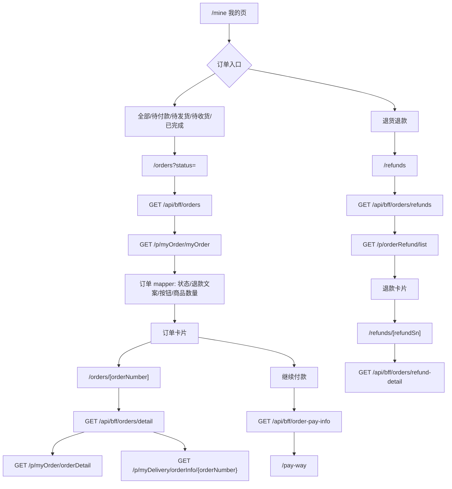

# 订单列表、退货退款和订单详情迁移方案

## 状态

implemented，2026-06-27 已完成页面、BFF、mapper 和操作按钮迁移；待 App WebView 真实 `mallToken` 联调验证。

## 迁移目标

将当前 H5 `/orders` 从本地 mock 升级为真实订单中心，覆盖我的页中的：

- 全部订单
- 待付款
- 待发货
- 待收货
- 已完成
- 退货退款
- 普通快递订单详情
- 退货退款详情

首期只迁移普通商品 + 快递订单。自提、虚拟核销、拼团/秒杀专属逻辑、真实支付确认、发票、评价、完整退款申请表单后置。

## 旧项目来源

| 模块 | 旧项目文件 | 说明 |
| --- | --- | --- |
| 普通订单列表 | `/Users/mac/company_code/mall4uni-bbc/src/package-user/pages/order-list/order-list.vue` | 普通订单 tab、搜索、分页、订单卡片、按钮 |
| 普通订单样式 | `/Users/mac/company_code/mall4uni-bbc/src/package-user/pages/order-list/order-list.scss` | 订单列表样式参考 |
| 普通订单详情 | `/Users/mac/company_code/mall4uni-bbc/src/package-user/pages/order-detail/order-detail.vue` | 普通快递详情、物流、地址、费用、按钮 |
| 退货退款列表 | `/Users/mac/company_code/mall4uni-bbc/src/package-refund/pages/after-sales/after-sales.vue` | 我的页“退货退款”入口 |
| 退款详情 | `/Users/mac/company_code/mall4uni-bbc/src/package-refund/pages/details-of-refund/details-of-refund.vue` | 退款详情和撤销/修改金额等后续动作 |
| 申请退款 | `/Users/mac/company_code/mall4uni-bbc/src/package-refund/pages/apply-refund/apply-refund.vue` | 后续退款申请表单参考 |

## 当前 H5 状态

- `/orders` 已接真实 H5 BFF，不再使用本地 mock 渲染订单列表。
- `OrderStatus` 已支持 `all/pending-payment/pending-shipment/pending-receipt/completed`，退货退款不属于普通订单状态。
- 我的页 `退货退款 -> /refunds` 入口请求 `/api/bff/orders/refunds`，不进入普通订单页 tab 和普通订单状态枚举；旧 `/orders?status=refund` 重定向到 `/refunds`。
- 已新增普通订单详情路由 `/orders/[orderNumber]`。
- 已新增退款详情路由 `/refunds/[refundSn]`；旧 `/orders/refunds/[refundSn]` 仅保留兼容重定向。
- 已复用 `/pay-way` 和 `/api/bff/order-pay-info` 承接“继续付款”链路。

## 路由建议

| 场景 | H5 路由 | 说明 |
| --- | --- | --- |
| 普通订单列表 | `/orders?status=all` | 默认全部订单 |
| 待付款 | `/orders?status=pending-payment` | Java `status=1` |
| 待发货 | `/orders?status=pending-shipment` | Java `status=2` |
| 待收货 | `/orders?status=pending-receipt` | Java `status=3` |
| 已完成 | `/orders?status=completed` | Java `status=5` |
| 退货退款列表 | `/refunds` | Java `/p/orderRefund/list` |
| 普通订单详情 | `/orders/[orderNumber]` | 普通快递详情 |
| 退款详情 | `/refunds/[refundSn]` | 售后退款详情 |

## 接口总览

| 场景 | H5 BFF | Java 接口 | 方法 |
| --- | --- | --- | --- |
| 普通订单列表 | `/api/bff/orders` | `/p/myOrder/myOrder` | GET |
| 退货退款列表 | `/api/bff/orders/refunds` | `/p/orderRefund/list` | GET |
| 普通订单详情 | `/api/bff/orders/detail` | `/p/myOrder/orderDetail` | GET |
| 订单物流摘要 | `/api/bff/orders/detail` 聚合 | `/p/myDelivery/orderInfo/{orderNumber}` | GET |
| 继续付款信息 | `/api/bff/order-pay-info` | `/p/order/getOrderPayInfoByOrderNumber` | GET |
| 取消订单 | `/api/bff/orders/cancel` | `/p/myOrder/cancel/{orderNumber}` | PUT |
| 确认收货 | `/api/bff/orders/receipt` | `/p/myOrder/receipt/{orderNumber}` | PUT |
| 删除订单 | `/api/bff/orders/delete` | `/p/myOrder/{orderNumber}` | DELETE |
| 联系商家留言 | `/api/bff/orders/contact-message` | `/p/myOrder/submitMessage` | POST |
| 退款详情 | `/api/bff/orders/refund-detail` | `/p/orderRefund/info` | GET |

所有 Java 请求由 H5 BFF 服务端发起，继承当前 `mallToken -> Authorization` 和 `source: 1` header 规则。

## 参数与来源

### 普通订单列表

旧项目：

```js
GET /p/myOrder/myOrder
{
  current: pageNo,
  size: pageSize,
  status: sts,
  prodName
}
```

H5 映射：

| H5 | Java | 来源 |
| --- | --- | --- |
| `current` | `current` | 分页状态，默认 `1` |
| `size` | `size` | 分页状态，默认 `10` |
| `status=all` | `status=0` | 我的页全部订单 |
| `status=pending-payment` | `status=1` | 我的页待付款 |
| `status=pending-shipment` | `status=2` | 我的页待发货 |
| `status=pending-receipt` | `status=3` | 我的页待收货 |
| `status=completed` | `status=5` | 我的页已完成 |
| `keyword` | `prodName` | 搜索框输入 |

### 退货退款列表

旧项目：

```js
GET /p/orderRefund/list
{
  current: pageNo,
  size: pageSize,
  startTime: "",
  endTime: ""
}
```

H5 首期 `startTime/endTime` 不展示筛选，传空或不传均可，推荐 BFF 内部默认空字符串以贴近旧项目。

### 普通订单详情

旧项目：

```js
GET /p/myOrder/orderDetail
{
  orderNumber
}

GET /p/myDelivery/orderInfo/{orderNumber}
```

H5 从 `/orders/[orderNumber]` route param 取 `orderNumber`。若详情返回 `orderMold === 1` 或 `dvyType === 2`，首期不进入普通详情渲染，展示后置说明。

### 继续付款

旧项目：

```js
GET /p/order/getOrderPayInfoByOrderNumber
{
  orderNumbers: orderNumber
}
```

H5 可复用已有：

```text
GET /api/bff/order-pay-info?orderNumbers=<orderNumber>&orderType=<orderType>&dvyType=<dvyType>&isPurePoints=0&ordermold=0
```

校验 `endTime` 未过期后跳转：

```text
/pay-way?orderNumbers=<orderNumber>&orderType=<orderType>&dvyType=<dvyType>&isPurePoints=0&ordermold=0
```

### 操作动作

| 动作 | Java | 参数来源 |
| --- | --- | --- |
| 取消订单 | `PUT /p/myOrder/cancel/{orderNumber}` | 当前订单卡片或详情 `orderNumber` |
| 确认收货 | `PUT /p/myOrder/receipt/{orderNumber}` | 当前订单卡片或详情 `orderNumber` |
| 删除订单 | `DELETE /p/myOrder/{orderNumber}` | 当前订单卡片或详情 `orderNumber` |
| 联系商家留言 | `POST /p/myOrder/submitMessage` | `orderNumber`、弹窗手机号、留言内容 |

联系商家旧请求体：

```ts
{
  orderNumber: string;
  userMobile: string;
  messageContent: string;
}
```

## 逻辑流程图



## 状态文案

旧项目订单状态数组：

| Java `status` | 文案 |
| --- | --- |
| 1 | 待付款 |
| 2 | 待发货 |
| 3 | 待收货 |
| 4 | 待评价 |
| 5 | 已完成 |
| 6 | 已取消 |
| 7 | 拼团中 |

物流状态：

| Java `deliveryDto.state` | 文案 |
| --- | --- |
| 0 | 在途 |
| 1 | 揽收 |
| 2 | 疑难 |
| 3 | 签收 |
| 4 | 退签 |
| 5 | 派件 |
| 6 | 退回 |
| 7 | 转投 |

退款状态首期按旧项目条件顺序迁移：

- `refundStatus === 1`：退款中。
- `returnMoneySts === 5 && refundStatus !== 3`：退款完成。
- `returnMoneySts === 5 && refundStatus === 3`：部分退款完成。
- `returnMoneySts === -1`：退款关闭。
- `status <= 2 && deliveryCount && productNums > deliveryCount`：部分发货。

## 列表卡片逻辑

旧项目每个订单加载后会补充：

- `totalCounts`：遍历 `orderItemDtos[].prodCount` 求和。
- `returnMoneySts` 为空时置为 `0`。
- `btns`：由 `getBtnCount()` 根据订单状态、退款状态、发票、评价、物流等条件生成。

H5 建议迁移为纯函数：

```ts
mapJavaOrderToOrderCard(javaOrder): OrderCardView
getOrderActionButtons(javaOrder): OrderAction[]
getRefundStatusText(javaOrder): string[]
getAfterSaleTags(orderItem): string[]
```

## 按钮首期迁移

| 按钮 | 首期处理 | 旧项目来源 |
| --- | --- | --- |
| 取消订单 | 接真实接口 | `onCancelOrder` -> `/p/myOrder/cancel/{orderNumber}` |
| 继续付款 | 接真实支付信息并跳 `/pay-way` | `onPayAgain` |
| 确认收货 | 接真实接口 | `/p/myOrder/receipt/{orderNumber}` |
| 查看物流 | 跳后续物流页或详情物流区 | `/package-user/pages/logistics-info/logistics-info` |
| 删除订单 | 接真实接口 | `/p/myOrder/{orderNumber}` |
| 联系商家 | H5 留言弹窗 | `/p/myOrder/submitMessage` |
| 评价 | 后置 | `/package-prod/pages/prod-comm/prod-comm` |
| 申请/查看发票 | 后置 | invoice pages |
| 申请退款 | 后置申请表单，首期可保留入口提示 | refund pages |
| 查看退款 | 跳退款详情 | `/p/orderRefund/info` |

## 订单详情展示

普通快递订单详情首期迁移：

- 顶部状态和待付款倒计时。
- 物流摘要：有物流时展示最新一条轨迹。
- 收货地址：`userAddrDto.receiver/mobile/province/city/area/addr`。
- 商品列表：图片、名称、规格、数量、价格、售后标签、退款入口状态。
- 费用明细：商品总额、运费、运费减免、平台优惠、积分抵扣、会员优惠、店铺优惠、实付款。
- 订单信息：订单编号、创建时间、支付方式、支付时间、配送方式、备注。
- 底部按钮：继续付款、联系商家、查看物流、确认收货、删除订单等。

后置：

- 自提订单详情。
- 虚拟商品核销详情。
- 发票详情和申请。
- 评价。
- 退款申请表单。
- 拼团详情。

## 退款详情展示

退款详情接口：

```js
GET /p/orderRefund/info
{
  refundSn
}
```

首期展示：

- 退款状态。
- 退款编号、申请时间、处理时间。
- 退款方式：仅退款 / 退货退款。
- 退款商品。
- 退款金额、积分。
- 买家原因、说明、凭证。
- 卖家备注、拒绝理由。
- 平台介入状态只展示，不做操作。

后置动作：

- 撤销退款：`PUT /p/orderRefund/cancel`
- 撤销平台介入：`PUT /p/orderRefund/cancel_platform_intervention`
- 修改退款金额：`PUT /p/orderRefund/updateRefundAmount`
- 退款申请/修改：`POST /p/orderRefund/apply`、`PUT /p/orderRefund/update_refund`

## 实施结果

1. 已创建订单领域类型、mapper 和测试：`src/features/mine-secondary/server/orders-real-service.ts`。
2. 已新增订单列表和退款列表 BFF，只读接入真实接口。
3. 已改造 `/orders`：支持真实分页、搜索、六个入口状态和退款列表。
4. 已新增普通订单详情 BFF 和页面。
5. 已新增退款详情 BFF 和页面。
6. 已接入首批操作按钮：取消、继续付款、确认收货、删除、联系商家。
7. 已补充错误态、空态、加载态和非普通快递后置提示。
8. 已更新飞书知识库页面清单和 API 对接说明。

## 验收清单

- [x] `/refunds` 调 `/p/orderRefund/list`，不是普通订单列表。
- [x] `/orders` 搜索传 `prodName`。
- [x] 普通订单 tab 切换传 `status=0/1/2/3/5`。
- [x] 订单卡片商品数量、总额、退款状态和按钮与旧项目一致。
- [x] 普通快递详情可展示地址、物流、商品、费用和订单信息。
- [x] 待付款订单可跳 `/pay-way`。
- [x] 取消、确认收货、删除、留言参数与旧项目一致。
- [x] 自提/虚拟订单不会误展示普通快递详情。
- [x] 接口失败、鉴权失败、空列表不展示 mock。
- [ ] 使用 App WebView 注入的真实 `mallToken` 验证 Java 返回数据和订单操作结果。
