# 订单与售后完整迁移计划

## 旧项目来源

- 订单列表：`package-user/pages/order-list/order-list.vue`
- 订单详情：`package-user/pages/order-detail/order-detail.vue`
- 物流详情：`package-user/pages/logistics-info/logistics-info.vue`
- 退货物流：`package-user/pages/write-return-logistics/write-return-logistics.vue`
- 售后列表：`package-refund/pages/after-sales/after-sales.vue`
- 售后详情：`package-refund/pages/details-of-refund/details-of-refund.vue`
- 选择退款方式：`package-refund/pages/choose-refund-way/choose-refund-way.vue`
- 申请退款：`package-refund/pages/apply-refund/apply-refund.vue`
- 平台介入/补充凭证：`package-refund/pages/plat-intervene/plat-intervene.vue`

## 迁移策略

旧 uni-app 页面大量依赖页面栈和本地缓存。本项目迁移为：

- BFF 负责 Java 接口对接、参数校验、字段标准化。
- React 页面负责 UI 状态、分页、弹窗、表单和路由。
- 退款申请上下文使用 `sessionStorage` 的 `meumall_refund_context` 传递，避免 URL 泄漏大量商品和费用字段。

## 接口流程

```mermaid
flowchart TD
  A["/orders"] --> B["GET /p/myOrder/myOrder"]
  A --> C["PUT /p/myOrder/cancel/{orderNumber}"]
  A --> D["PUT /p/myOrder/receipt/{orderNumber}"]
  A --> E["DELETE /p/myOrder/{orderNumber}"]
  A --> F["POST /p/myOrder/submitMessage"]
  A --> G["GET /p/order/getOrderPayInfoByOrderNumber"]
  H["/orders/{orderNumber}"] --> I["GET /p/myOrder/orderDetail"]
  H --> J["GET /p/myDelivery/orderInfo/{orderNumber}"]
  H --> K["写入退款上下文"]
  K --> L["/refunds/choose-way 或 /refunds/apply"]
  L --> M["POST /p/orderRefund/apply"]
  L --> N["PUT /p/orderRefund/update_refund"]
  O["/refunds"] --> P["GET /p/orderRefund/list"]
  Q["/refunds/{refundSn}"] --> R["GET /p/orderRefund/info"]
  Q --> S["PUT /p/orderRefund/cancel"]
  Q --> T["PUT /p/orderRefund/updateRefundAmount"]
  Q --> U["PUT /p/orderRefund/cancel_platform_intervention"]
  V["/refunds/platform-intervention"] --> W["PUT /p/orderRefund/apply_platform_intervention"]
  V --> X["POST /p/orderRefundIntervention/saveInterventionVoucher"]
  Y["/refunds/return-logistics"] --> Z["GET /p/delivery/list"]
  Y --> AA["POST /p/orderRefund/submitExpress"]
  Y --> AB["PUT /p/orderRefund/reSubmitExpress"]
```

## 设计还原范围

- 还原旧项目卡片式列表、店铺头、订单状态、商品行、合计行、底部按钮。
- 还原订单详情状态头、物流摘要、收货信息、费用明细和订单信息。
- 还原售后列表的申请类型、退款状态、平台介入进度文案。
- 还原售后详情的状态说明、退款商品、退款信息、凭证、退货地址、物流信息和底部操作。

## 本期降级

- 图片上传先使用逗号分隔图片路径输入，待原生 App 或 H5 文件上传能力确认后再接完整上传。
- 发票、评价、拼团详情、店铺、客服 IM 保留提示或占位，不阻塞订单与售后主流程。
